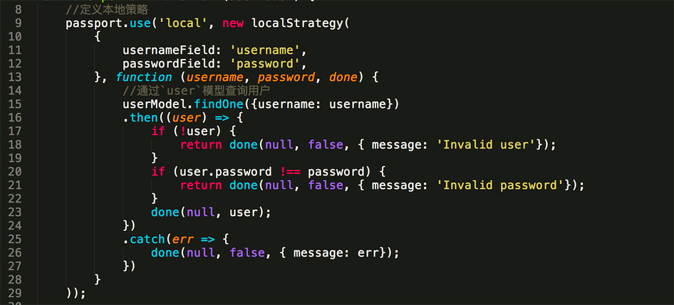
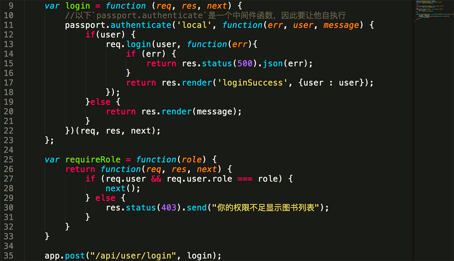

## passprot

passport的作用主要是两个:

1、实现用户登录验证逻辑。

2、`passport.serializeUser` 和 `passport.deserializeUser`

### 实现用户登录逻辑

#### 定义策略

定义`local`策略，其中`username`和`password`是通过`app.use(bodyParser.json())`和

`app.use(bodyParser.urlencoded({ extended: false }))` 这个两个中间件解析到`req.body`上,而passport会直接从`req.body`上获取参数。

当请求头中属性`contentType:application/json`，在`app.use(bodyParser.json())`解析后，请求参数会添加到`req.body`。

当请求头中属性为`Content-Type: application/x-www-form-urlencoded`,

在`app.use(bodyParser.urlencoded({ extended: false }))`解析后，也会把解析的值添加到`req.body`。

#### 策略初始化，加入到应用中

#### 根据登录api，路由到相应的策略进行调用

### `passport.serializeUser` 和 `passport.deserializeUser`

#### for serializeUser

1、当一个用户提交`登录`表单,根据路由调用到`passport.authenticate`中间件,因为中间件是一个函数，因此需要设置函数自执行。

2、授权中间件根据之前的配置的本地策略,调用实现的本地策略。

3、Passport从req.body.username and req.body.password获取用户名和密码,执行验证函数,具体在本地策略中实现。

4、现在我们做的事情是:根据用户名在数据库中查找用户，查完之后，匹配密码是否正确。

5、如果没问题的话，触发done(null, user)函数。

6、调用done(null, user)函数会调用`passport.authenticate`的回调。

7、在回调函数中调用`req.login`(这是一个中间件函数,绑定到请求函数中)。

8、在`req.login`中自动调用`passport.serializeUser`序列化用户保存到`mongodb`数据库中，同时可以选择保存整个对象还是用户Id，这里保存的是用户Id。

#### for deserializeUser

1、passport.initialize中间件对于每次请求都会触发,目的是确定session包含一个`passport.user`对象，尽管可能是空的。

2、如果序列化的用户在服务器端的数据库存在，`passport.session`中间件可以把数据库中的user这个对象获取赋值给`req.user`。而`passport.session`也会在每次请求时触发。

3、`passport.deserializeUser`这个函数由`passport.session`触发。在每次请求中可以加载`user`信息，然后把`user`对象`attach`到req.user。

注:

1、`Local Strategy`仅仅被在特定路由上使用`passport.authenticate `被触发。

2、而仅仅`passport.serializeUser`函数被执行后,用户信息才会被存储到`sessions`中。

