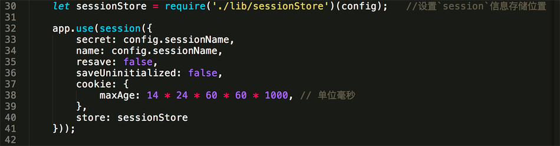

## session

### server端生成cookie
当登陆成功后，服务器端通常会生成并维护一个会话，同时为这个会话绑定一个ID(Sessioin ID)，然后把这个ID通过response对象的`set-cookie`属性保留在访问服务器的客户端。

用 Curl 进行 POST 的测试：
```
curl -X POST http://localhost:3000/api/user/login \
-H 'Content-Type: application/json' \
-d '{"username":"zwn","password":"123456"}' \
-v
```
反斜线（ \ ）代表指令未完，下一行继续。

-H 设定 Header，这里指定资料类型为 JSON。

-d 后面接资料主题，这里的格式是 JSON 。

-v 显示详细资讯，可省略。

图示:


### client保存cookie
后面每一次对服务器的请求或操作，浏览器都会带上这个 Cookie，服务器通过 Session ID 来提取相应的 Session 数据，并识别出你。所以你的每一个操作，系统都能知道是你，并记得之前的你。但是，如果这个会话过期了（比如说登录后长时间没任何操作），系统就需要你重新登录验证一次才能继续操作。

用 Curl 进行 POST 的测试：
```
curl -X POST http://localhost:3000/api/book/list \
 -H 'Content-Type: application/json' \ 
 --cookie "test=s%3ADcIpHmNAExQKl8SYAjjyB1tQeP2-R0OQ.EiFx2UbnXgvxQbTHhIazQbApZSF4b7uLSVctTEPcxx0; Path=/; Expires=Fri, 26 Jan 2018 20:31:06 GMT; HttpOnly" \
 -v
```

图示:


### sessions存储
虽然服务器的 Session 允许存储不少信息，但是一般只存储用户 ID 就够了。数据存储的越多，越浪费内存和影响性能。同时，在一些用户量大，需要做负载均衡的系统，任何一个请求都不能保证下一次和这次通信的服务器是同一个，所以 Session 的数据一般都存储在所有服务器都能访问的内存型数据库，比如 Mongodb或者Redis，现为Mongodb

detail sessions（in index.js）




把session数据保存到mongodb数据库中,其中先new一个存储集合，集合名称是`sessions`,然后通过`session`中间件的store设置保存到数据库中，`secret`是生成cookie的秘钥，`name`为保存到客户端的cookie属性名。


